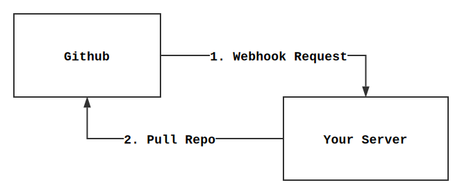

# Webhook To Pull

Recevied webhook request then pull repository. For continuous deployment.

For example: your server can pull repository automatically after you push a commit to Github/Gogs.



## How to use

### 0. Prerequisites

- Git
- Node.js environment

### 1. Install

``` bash
git clone https://github.com/hangxingliu/webhook-to-pull.git
cd webhook-to-pull
npm install --production
```

### 2. Configure

``` bash
cp example.config.json config.json
vim config.json # configure your repository and its webhook information
npm start -- test # for test your config is fine 
```

### 3. Launch

``` bash
# Way1: Keep this program running in the background by pm2
sudo npm install pm2 -g
pm2 start ecosystem.yml

# Way2: just launch
npm start
```

And you can access follwing URL in browser or cURL to make sure this program is running:
`http://127.0.0.1:8080/` (replace `8080` to your port number if you changed in config file)

### 4. Configure Webhook in Github/Gogs

1. Goto **Webhooks** page in your repository's **Settings** page.
2. Click **Add webhook**
3. Setup following configurations and click **Add webhook**
	- **Payload URL**: `http://${YOUR_DOMAIN}:${PORT}/hook`
	- **Content type**: `application/json`
	- **Secret**: The secret you setup in your config file

## Author

[LiuYue (@hangxingliu)](https://github.com/hangxingliu)

## License

[GPL-3.0](LICENSE)
